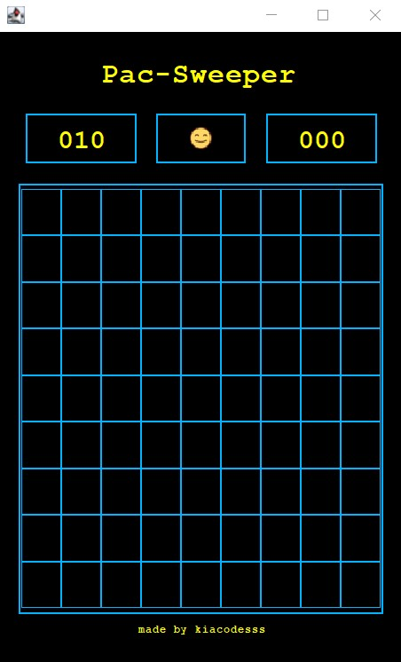
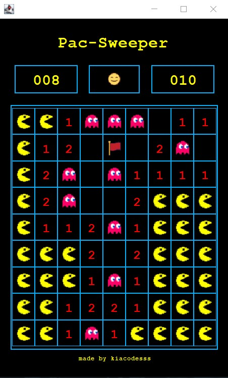

# ⭐ Pac-Sweeper
> A retro Pac-Man-inspired take on the classic Minesweeper game, built with Java Swing.

---

## 📌 About the Game

**Pac-Sweeper** is a Pac-Man-inspired Minesweeper game built with Java Swing, featuring a retro arcade-style interface.

Players reveal cells, avoid hidden mines, use Pac-Man and ghost icons, and place flags on suspected mine locations while trying to clear the board before time runs out.

---

## 👀 Preview

<div align="center">

<h3>Pac-Sweeper Game Preview</h3>

<table>
  <tr>
    <td align="center">
      
    </td>
    <td align="center">
      
    </td>
  </tr>
</table>

</div>

---

## ✨ Features

- Retro arcade-inspired interface
- 9×9 Minesweeper game board
- 10 randomly generated mines
- First-click safe system
- Pac-Man and ghost character icons
- Flagging system for suspected mines
- Remaining mine counter
- 180-second time limit
- Automatic cell revealing for empty spaces
- Win and lose conditions
- Reset button for starting a new game
- Game-over and victory messages

---

## 🧩 Key Systems

### 🎮 Game Logic
- Random mine generation after the player's first move
- Automatic calculation of adjacent mine counts
- Safe first-click system
- Recursive cell revealing for empty spaces
- Win detection based on revealed safe cells
- Game-over detection when a mine is triggered

### 🚩 Flag System
- Right-click cells to place or remove flags
- Tracks the number of remaining mines
- Uses a custom flag icon to mark suspected mine locations

### ⏱️ Timer System
- Starts when the first cell is revealed
- Tracks the player's completion time
- Automatically ends the game after 180 seconds

### 🖥️ Graphical User Interface
- Built using Java Swing
- Custom board buttons and borders
- Retro-inspired black, yellow, and blue color scheme
- Custom Pac-Man-themed icons for different game states

---

## 🛠️ Technologies Used

| Technology | Purpose |
|---|---|
| **Java** | Core game logic and application programming |
| **Java Swing** | Graphical user interface |
| **Apache NetBeans** | Development environment |
| **Git & GitHub** | Version control and project distribution |
| **ChatGPT** | Troubleshooting and development assistance |

---

## 🚀 Running from Source

### Requirements

- Java JDK 25
- Apache NetBeans IDE 28 (recommended)
- Windows operating system

### Steps

1. Clone the repository:

   ```bash
   git clone https://github.com/kiacodesss/pac-sweeper-game.git
   ```
   
2. Open the project in NetBeans.
3. Allow NetbBeans to load and configure the project.
4. Build the project in NetBeans.
5. Run the application.

---

## 📦 Release

A ready-to-run version is available under **GitHub Releases**.

**[Download Pac-Sweeper for Windows](../../releases/latest)**

The included JAR file contains the compiled Pac-Sweeper application and can be used to
run the game without opening the project in NetBeans.

---

## 🎓 Project Information

Pac-Sweeper was developed as an academic project for the **Intermediate Programming** course.

The project applies fundamental Java programming concepts through the development of an interactive Minesweeper game,
including game logic, event handling, user interface design, and object-oriented programming using Java Swing and NetBeans.

---

## 📄 License

This project is for educational and portfolio purposes.
